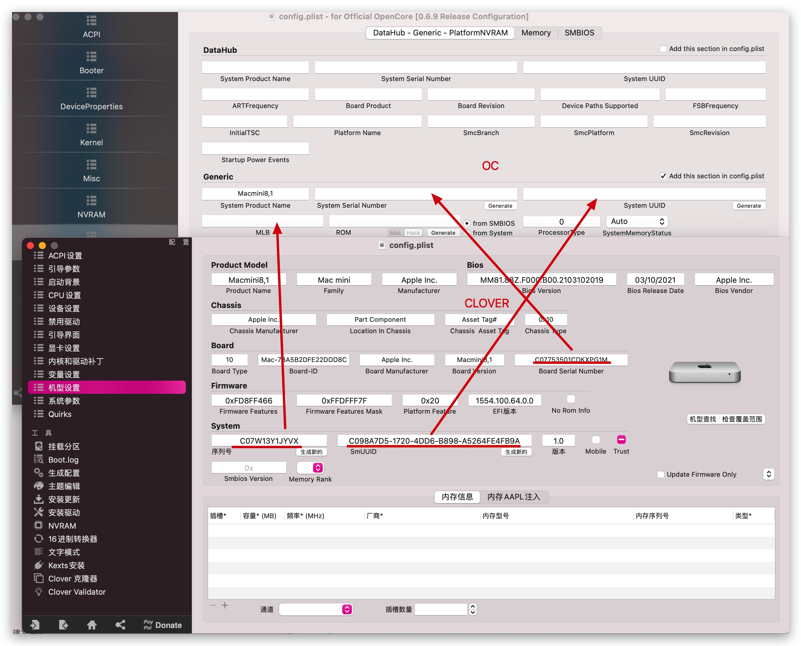
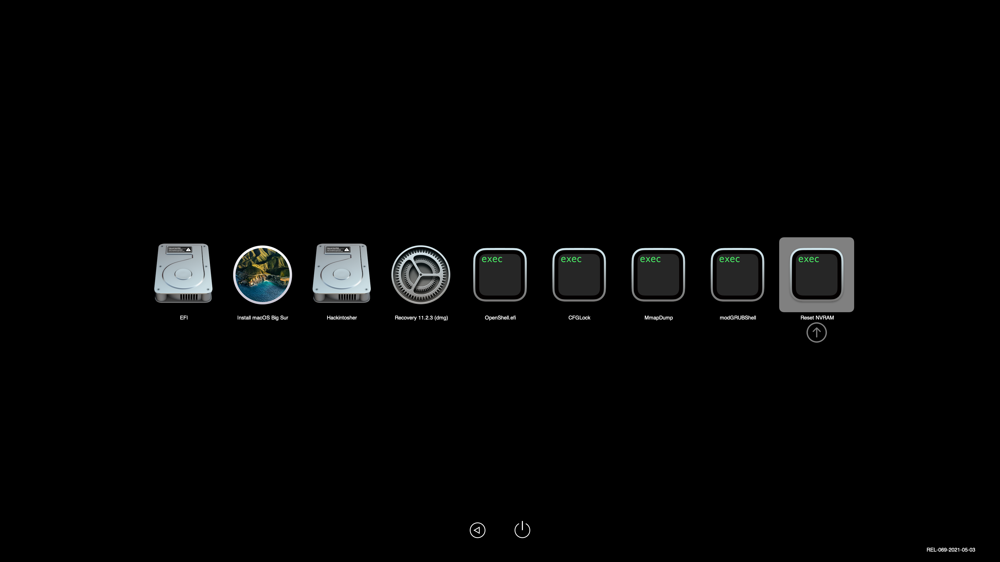
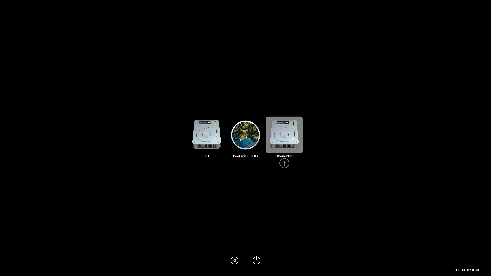
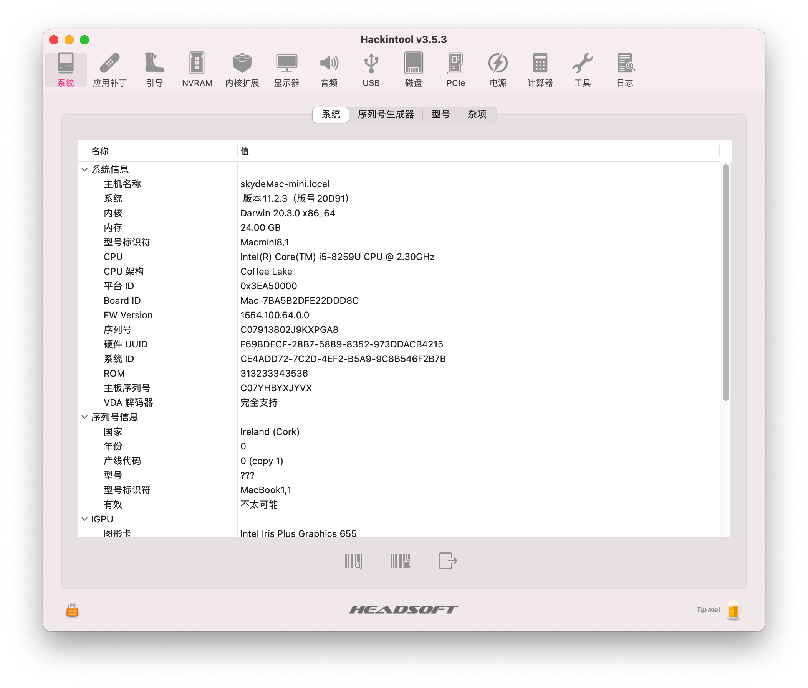
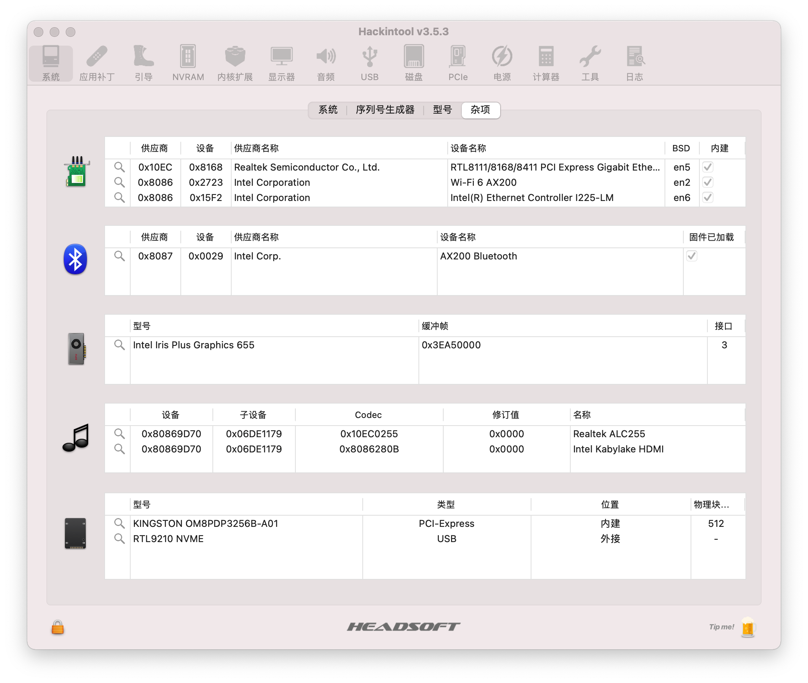
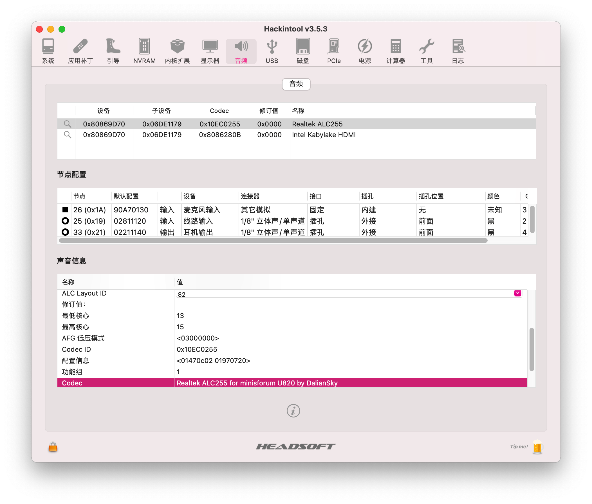
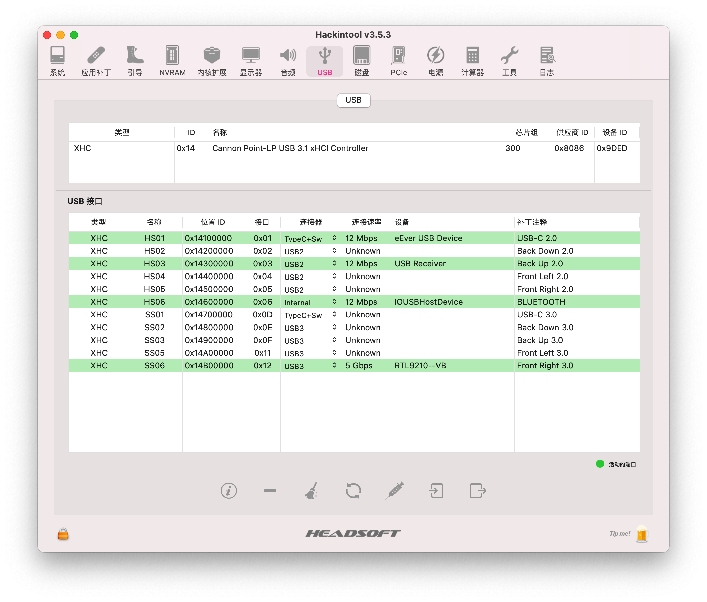
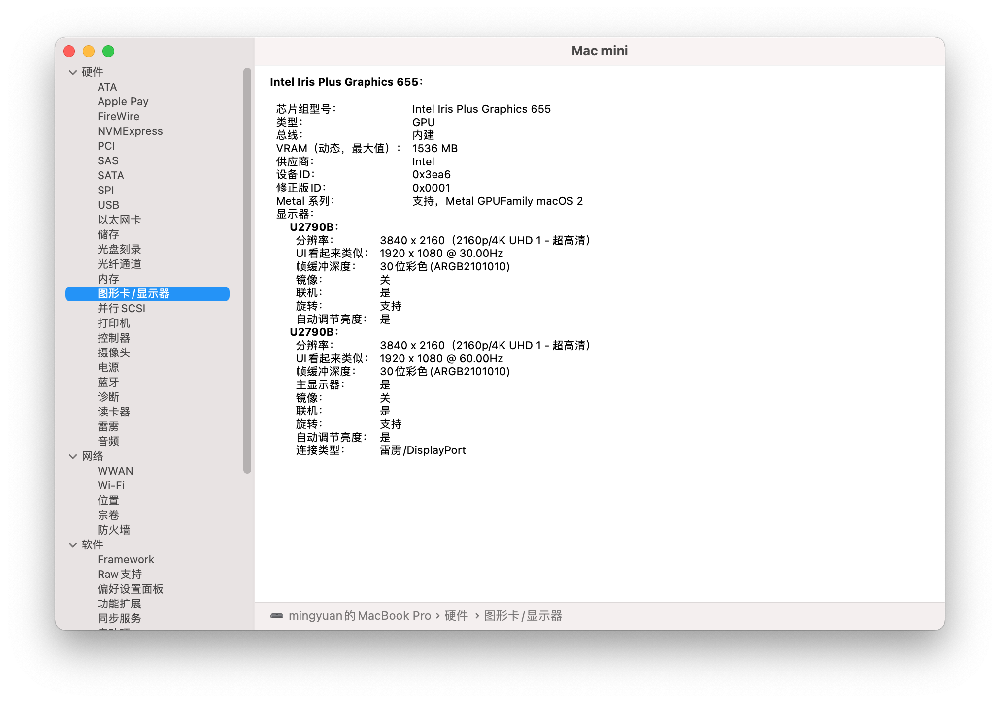
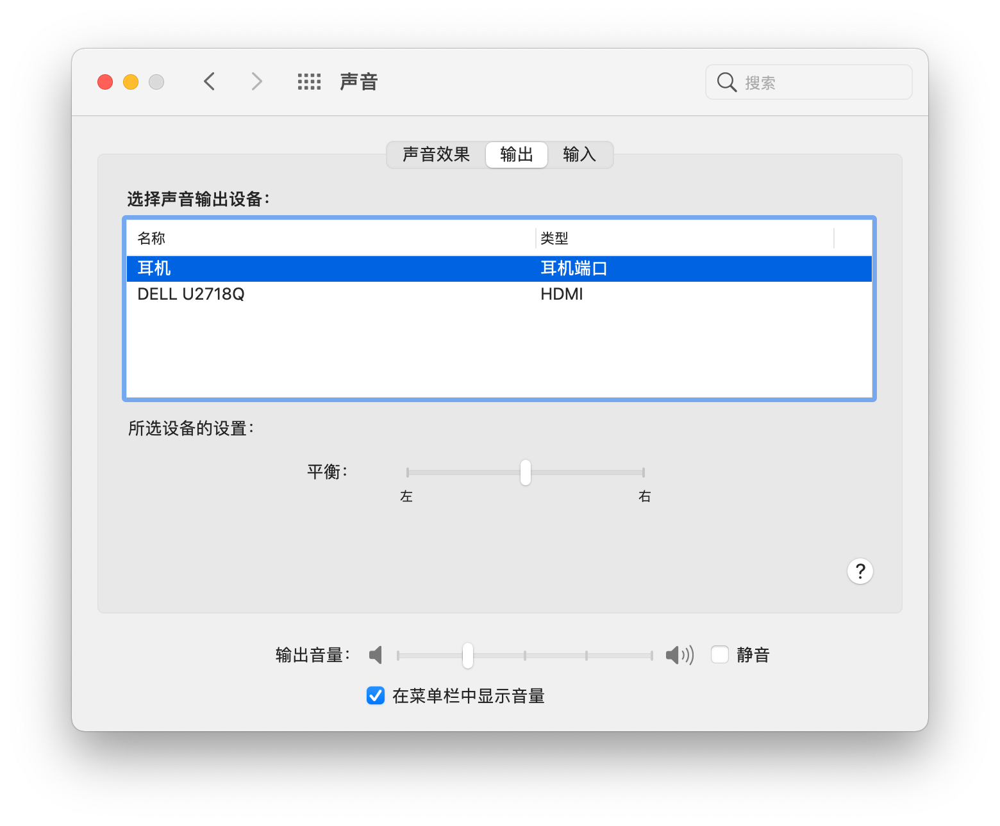

# minisforum-u820-hackintosh

## 电脑配置

|   规格   |                           详细信息                           |
| :------: | :----------------------------------------------------------: |
| 电脑型号 |                       minisforum U820                        |
| 操作系统 |                        macOS Big Sur                         |
|  处理器  |                     英特尔 酷睿 i5-8259U                     |
|   内存   |                        16 GB 2400MHz                         |
|  硬盘1   |                   KINGSTON OM8PDP3256B-A01                   |
| 硬盘2/3  |                    可接SATA 2.5寸硬盘/SSD                    |
|   显卡   |                 Intel Iris Plus Graphics 655                 |
|  显示器  |                              无                              |
|   声卡   |                  Realtek ALC255 `alcid=82`                   |
|   网卡   | m.2 NGFF插槽，已更换为[BCM94360Z4](https://blog.daliansky.net/uploads/WeChatandShop.png) |

## 更新日志

- 5-17-2021

  - OpenCore `v0.6.9`
  - Release `v1.2.0`
  
- 4-17-2021

  - CLOVER `v5127`
  - Release `v1.0.0`
  - 更新了新的[BCM94360Z4](https://blog.daliansky.net/uploads/WeChatandShop.png)驱动

- 4-23-2021

  - CLOVER `v5133`
  - 更换主题为`DiscBlackC`
  - 移除了`-v`引导参数

  

### 设置`BIOS`

- 安全菜单：

  - 安全启动 -> `关闭`  (*Disable Secure Boot*)

- 高级菜单：

  - CPU菜单：`CFG Lock` -> `关闭` (*Disabling CFG Lock*)【相关BIOS请进群获取】

- 设备：

  - 显示设备
    - 预指派内存大小：`64MB` (*DVMT* pre-allocated memory)

  - ATA设备菜单：
    - `配置SATA为` -> `AHCI`

- 其它参数默认即可

## CLOVER替换成OC引导的必要操作步骤

1. 替换三码，[下载](https://mackie100projects.altervista.org/opencore-configurator/)`OpenCore Configurator`，以及[下载](https://mackie100projects.altervista.org/download-clover-configurator/)`Clover Configurator`，分别打开`config.plist`文件，按下图进行替换操作，然后保存
2. 重启，在`OpenCore`主引导界面，按`空格`键，光标移动到`Reset NVRAM`图标回车即可
3. 替换`EFI`的操作请参考其它教程

## 截屏

## 其它信息

minisforum U820黑苹果交流群：[869792897](https://qm.qq.com/cgi-bin/qm/qr?k=TdIS59sEdBCjbz8NbdrQ2IyPG6bMza3_&jump_from=webapi)
minisforum U820购买链接：[黑果小兵的部落阁](https://hackintosher.taobao.com/) 

## 感谢名单：

- [Apple](https://apple.com/) for macOS;
- [Acidanthera](https://github.com/acidanthera) for OpenCore and all the lovely hackintosh work.
- [Dortania](https://dortania.github.io/OpenCore-Install-Guide/config-laptop.plist/icelake.html) For great and detailed guides.

- [jozews321](https://github.com/jozews321) For the injection information in the U820 device properties

