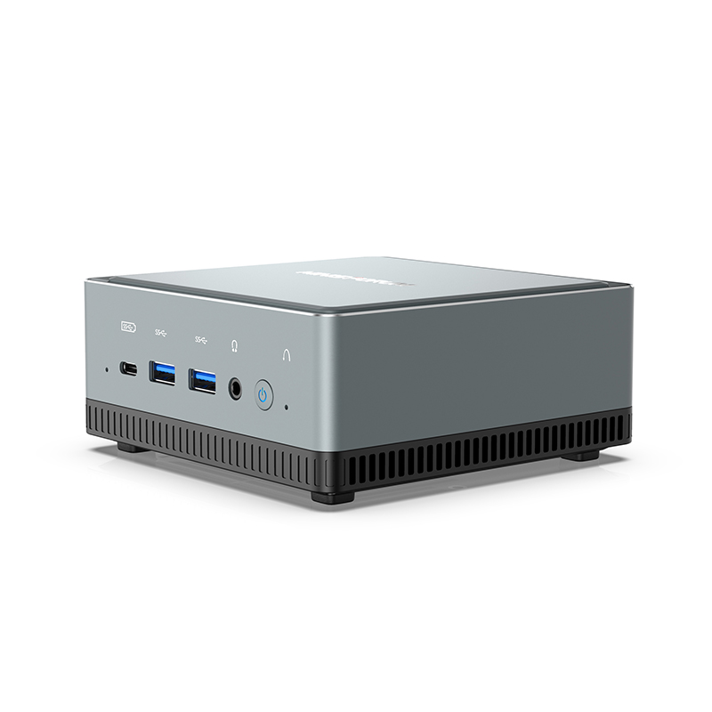
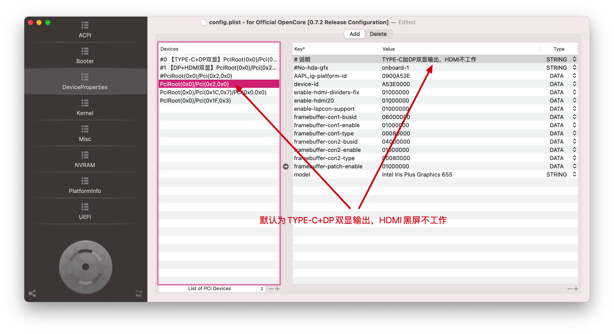
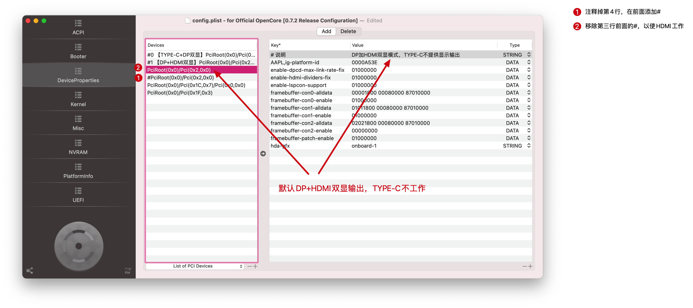
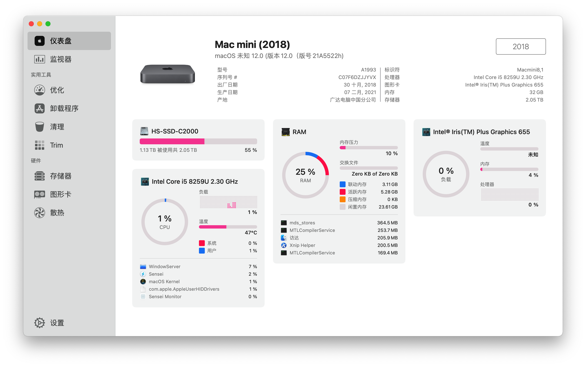
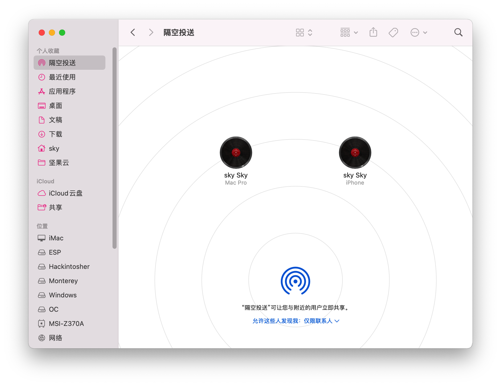
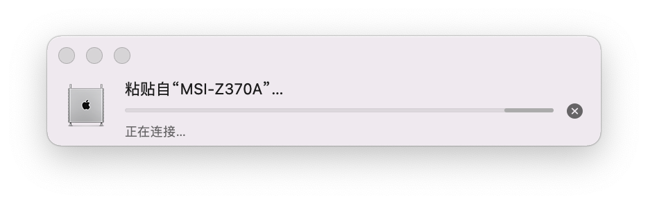
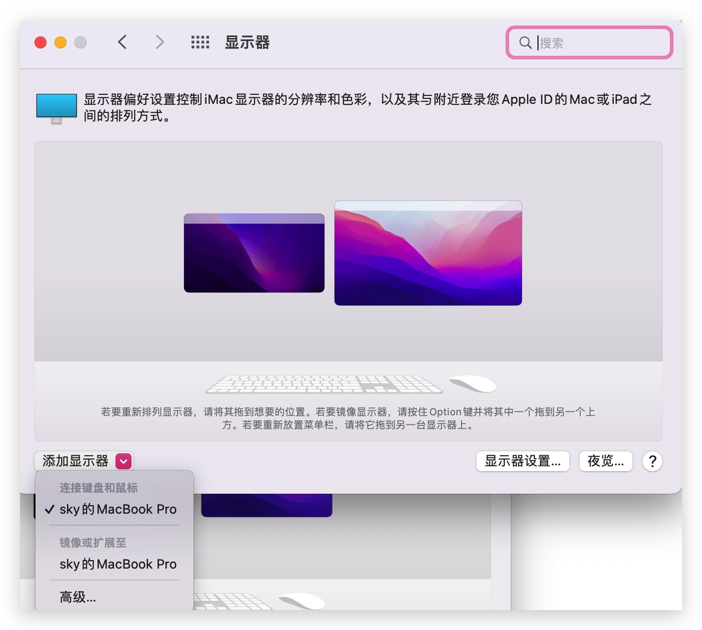
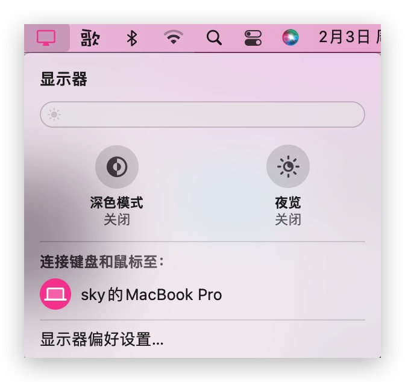

# minisforum-u820-hackintosh

 
  

## 电脑配置

|   规格    |                           详细信息                           |
| :-------: | :----------------------------------------------------------: |
| 电脑型号  |                       minisforum U820                        |
| 操作系统  |     macOS `Mojave` / `Catalina` / `Big Sur` / `Monterey`     |
|  处理器   |               英特尔 酷睿 i5-8259U / i5-8279U                |
|   内存    |                        16 GB 2400MHz                         |
|   硬盘1   |                   KINGSTON OM8PDP3256B-A01                   |
|  硬盘2/3  |                    可接SATA 2.5寸硬盘/SSD                    |
|   显卡    |                 Intel Iris Plus Graphics 655                 |
|  显示器   |                              无                              |
|   声卡    |                  Realtek ALC255 `alcid=82`                   |
| 无线网卡  | m.2 NGFF插槽，默认出厂为 `Intel AX200`/`Intel 7260` 已更换为[BCM94360Z4](https://blog.daliansky.net/uploads/WeChatandShop.png) |
| 有线网卡1 |      **Intel I225-V 2.5G Gigabit Ethernet Controller**       |
| 有线网卡2 |   **Realtek RTL8168H/8111H PCI Express Gigabit Ethernet**    |

## 网卡使用情况

- Intel AX200/7260
  - 为板载无线网卡，默认出厂自带，黑苹果支持接力，不支持隔空
- BCM94360Z4
  - 选配，支持隔空、接力、热点等

## 更新日志

- 2-10-2022
  
  - 更新 `OpenCore` `v0.7.8`
  - 调整 `config.plist` 请执行 `reset NVRAM` 后食用
  
- 1-30-2022

  - Release `v2.1.0`
  - 更新 `OpenCore` `v0.7.7`
  - 支持 `Monterey` `12.3Beta`

- 10-27-2021

  - Release `v2.0.0`
  - 修正 `Intel` 蓝牙驱动，支持 `Monterey` 安装使用
  - 默认支持 `HDMI` + `DP` 双显输出，如果需要使用 `TYPE-C` + `DP` 双显请参考下面的截图修改
  - 更新 `OpenCore` 为 `v0.7.5`
  - 请使用工具  [OCAT_Mac.dmg](./OCAT_Mac.dmg) 编辑 `config.plist` 

- 10-22-2021

  - Release `v1.8.0`
  - 默认支持 `HDMI` + `DP` 双显输出，如果需要使用 `TYPE-C` + `DP` 双显请参考下面的截图修改
  - 更新 `OpenCore` 为 `v0.7.5`

- 9-8-2021

  - Release `v1.7.0`
  - 默认支持 `HDMI` + `DP` 双显输出，如果需要使用 `TYPE-C` + `DP` 双显请参考下面的截图修改
  - 更新 `OpenCore` 为 `v0.7.3`
  - 请使用工具  [OCAT_Mac.dmg](./OCAT_Mac.dmg) 编辑 `config.plist` 

- 9-3-2021

  - Release `v1.6.0`
    - 适配 `Monterey`

- 7-30-2021

  - Release `v1.5.0`
    - 修复了`TYPE-C`显示输出问题
    - 修复了`Intel I225-V`的驱动问题，支持`Catalina` / `Bigsur` / `Monterey`

- 7-19-2021

  - Release `v1.4.0`
    - 支持`macOS Monterey`的安装使用

- 5-18-2021

  - Release `v1.3.0`
    - 修复了睡眠唤醒问题

- 5-17-2021

  - OpenCore `v0.6.9`
  - Release `v1.2.0`

- 4-17-2021

  - CLOVER `v5127`
  - Release `v1.0.0`
  - 更新了新的[BCM94360Z4](https://blog.daliansky.net/uploads/WeChatandShop.png)驱动

- 4-23-2021

  - CLOVER `v5133`
    - 更换主题为`DiscBlackC`
    - 移除了`-v`引导参数

  

### 设置`BIOS`

- 安全菜单：

  - 安全启动 -> `关闭`  (*Disable Secure Boot*)

- 高级菜单：

  - CPU菜单：`CFG Lock` -> `关闭` (*Disabling CFG Lock*)【相关BIOS请进群获取】

- 设备：

  - 显示设备
    - 预指派内存大小：`64MB` (*DVMT* pre-allocated memory)

  - ATA设备菜单：
    - `配置SATA为` -> `AHCI`

- 其它参数默认即可

## `TYPE-C` / `DP` 显示输出参数修改

默认参数为[`TYPE-C加DP双显输出，HDMI不工作`]

## `DP` / `HDMI` 显示输出参数修改

如果显示器接的是 `HDMI` 接口，那么需要调整下配置文件中的参数，见截图右侧说明

## CLOVER替换成OC引导的必要操作步骤

1. 替换三码，[下载](https://mackie100projects.altervista.org/opencore-configurator/)`OpenCore Configurator`，以及[下载](https://mackie100projects.altervista.org/download-clover-configurator/)`Clover Configurator`，分别打开`config.plist`文件，按下图进行替换操作，然后保存
2. 重启，在`OpenCore`主引导界面，按`空格`键，光标移动到`Reset NVRAM`图标回车即可
3. 替换`EFI`的操作请参考其它教程

## 注意事项

登录 `Apple ID` 之前，请务必重新生成三码，否则有可能会导致无法登录 `App Store`，教程详见群公告里的链接

SATA 接口中有一条属于光驱位，因此可能导致无法抹盘，安装时如果遇到此情况请使用另外一个 SATA 接口

## 截屏

### 支持通用控制

## 其它信息

minisforum U820黑苹果交流群：[869792897](https://qm.qq.com/cgi-bin/qm/qr?k=TdIS59sEdBCjbz8NbdrQ2IyPG6bMza3_&jump_from=webapi)

minisforum U820购买链接：[黑果小兵的部落阁](https://hackintosher.taobao.com/) 

## 感谢名单：

- [Apple](https://apple.com/) for macOS;
- [Acidanthera](https://github.com/acidanthera) for OpenCore and all the lovely hackintosh work.
- [Dortania](https://dortania.github.io/OpenCore-Install-Guide/config-laptop.plist/icelake.html) For great and detailed guides.

- [jozews321](https://github.com/jozews321) For the injection information in the U820 device properties

